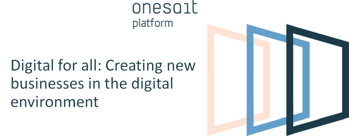
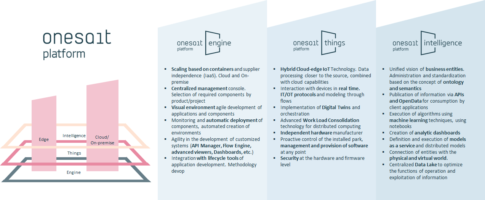
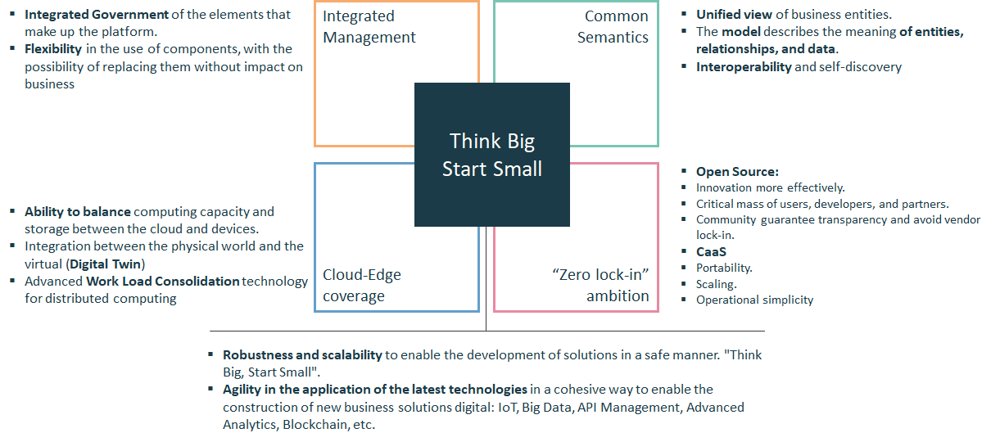
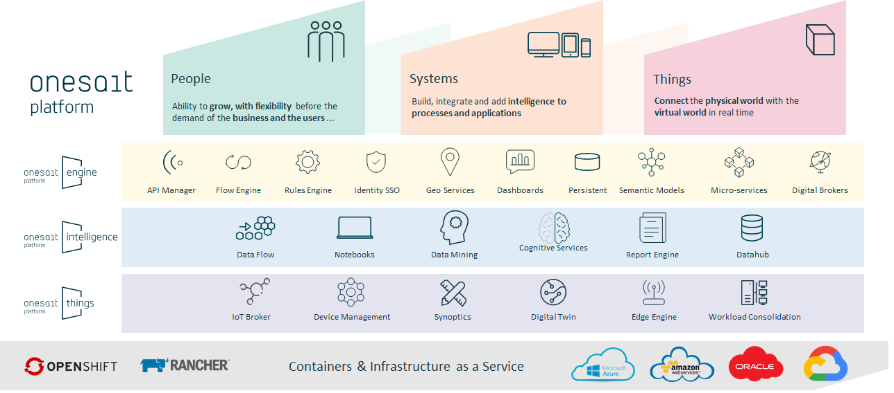

  

 
## Versions 
The platform has 3 distributions, that combined, they cover transformation and creation of new digital business needs

    

## Why?
We are sure that we have a unique offer in the market based on a combination of differential elements:

    

## Definition & Modules
**onesait Platform** is a technological platform that accelerates the digital transformation, allowing the agile construction of applications through the use of integrated open source components and the combination of the latest technologies in the treatment, intelligent analysis and publication of information. 
It has a large catalog of components that enable the construction of classic management applications, as well as advanced systems that apply intelligence to processes, connect the physical world with the virtual one, or scale intelligently to adapt to the needs of the business.

    

You can find a complete description of these modules at [Platform Modules](https://onesaitplatform.atlassian.net/wiki/spaces/OP/pages/177078320/Platform+Modules)

If you want a more technical detail you can read our [Architectural Guides](https://onesaitplatform.atlassian.net/wiki/spaces/OP/pages/360455/Architecture+Guides)

## Getting started with the platform 

The best way yo start with Onesait Platform is accesing our [Developer Portal](https://onesaitplatform.atlassian.net/wiki/spaces/OP/pages/45842643/Platform+Guides) where you can find a complete set of guides and tutorials.

For the quick start you can start watching one of the [Introductory Videos](https://onesaitplatform.atlassian.net/wiki/spaces/OP/pages/31424597/Introductory+Videos)
or perhaps you prefer to work with the Platform, then follow our [Getting Started Guide](https://onesaitplatform.atlassian.net/wiki/spaces/OP/pages/33179/Getting+Started)

## Getting help

Having trouble with onesait Platform? We’d like to help!

* Check the reference documentation, especially the [Platform Guides](https://onesaitplatform.atlassian.net/wiki/spaces/OP/pages/45842643/Platform+Guides), they provide solutions to the most common questions.
* Learn more about the platform in our [Confluence Developer Portal]( https://onesaitplatform.online)
* Report bugs of the platform at [onesait Platform GitHub](https://github.com/onesaitplatform)

## Roadmap & Contributions

At the link you can find our [2018-2019 Roadmap](https://onesaitplatform.atlassian.net/wiki/spaces/OP/pages/32979/Roadmap+onesait+Platform+Cloud)

As we are working on a open source model, you can contribute with us. To contribute to onesait Platform, please visit [How to contribute](https://onesaitplatform.atlassian.net/wiki/spaces/OP/pages/9142309/Contribution+Guide) information.

## License

onesait Platform is Open Source software released under the [Apache Software License 2.0](http://www.apache.org/licenses/LICENSE-2.0).

See [`LICENSE`](LICENSE) and [`copyright.txt`](copyright.txt) for details.

