onesait Platform Example Android HealthCheckApp
============================

## Features overview
This app is a full working example showcasing several tools available in the platform to deal with:

1. User authentication: OAuth-based user authentication for any operation
2. Data privacy enhacements: Patient data is protected with private APIs that belong to the patient. As data owner, the patient is able to grant and revoke access to his data at any time via API calls within the app (Auth as-a-Service) or via S4C control panel.
3. APIfication: All interaction with S4C Platform is performed via APIs registered in the API Manager module.

## App overview

The app features two different behaviors depending on the end-user profile. For this case, 2 users have been created:

1. citizenHealth: This role performs as a health-aware citizen that keeps track of some of his health-related paremeters (weight, blood pressure, etc..) Using the app, the citizen is able to log this data to S4C Platform. Then data is stored and available to him for self-analytics and/or medical evaluation (upon the citizen approval of data sharing).
2. specialistHealth: This role performs as a medical specialist that offers her expertise. S4C platform allows this specialist to give service to any registered patient within the S4C ecosystem, anytime, anywhere. On the app screen she will be able to check her mailbox (an ontology with public access via a public API so any citizen can send requests). The mailbox contains anonymous health data from the incoming patient requests (previous patients approval to share their data with the selected specialist). Then the specialist is able to send feedback to the patient using the app an S4C platform.

## User guide: citizenHealth

- After the welcome screen, the user will log in with the S4C credentials:

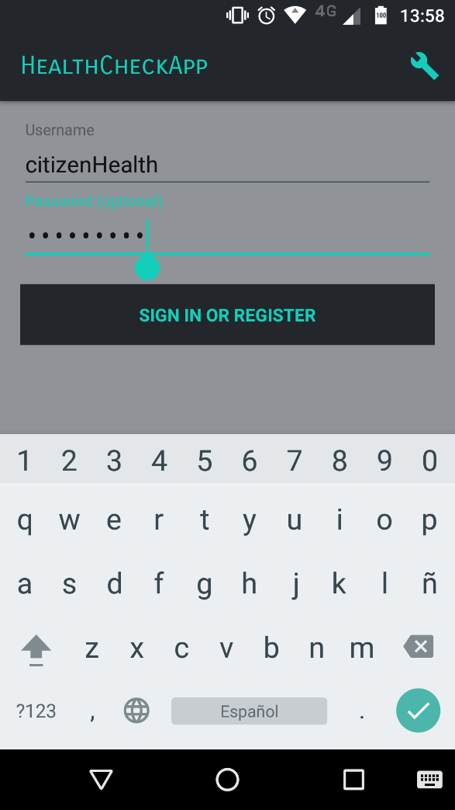

- Then the main menu app appears, with all the options available

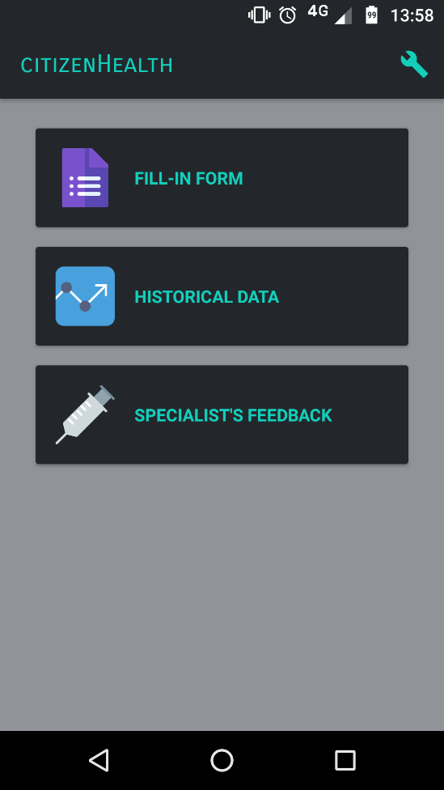 

- First command refers to data logging via a form. The citizen will fill it with personal data and store it on S4C Platform

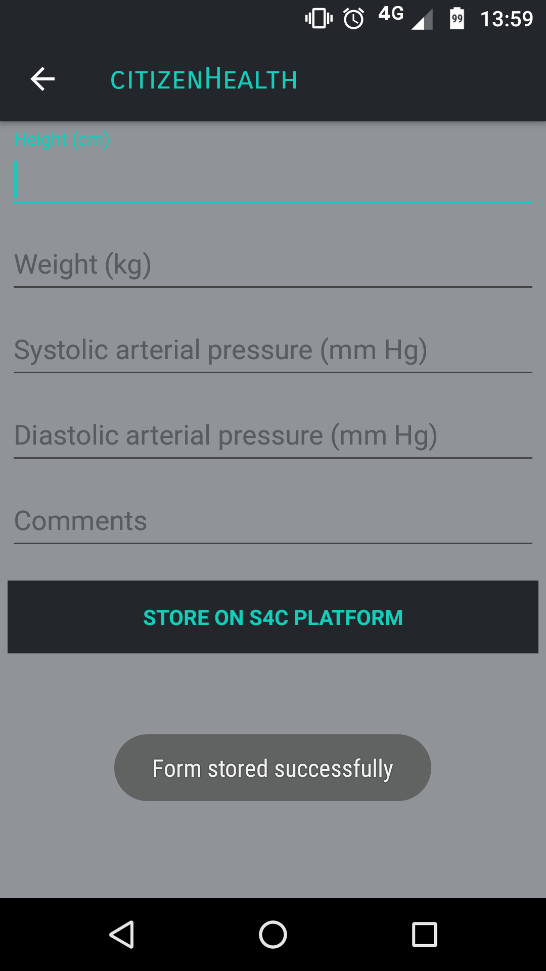 

- Second command from the main menu serves as a tool to visualize all historical data logged by the user

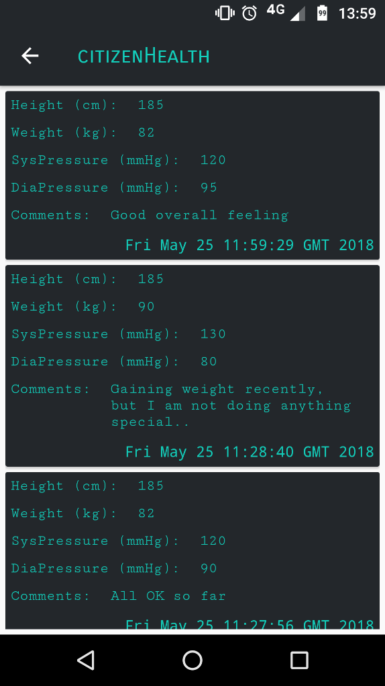 

- Last command opens a new screen for all specialist related actions

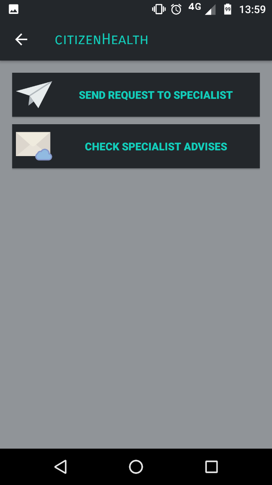

- First of all, the citizen can request feedback from an specialist (only one is available at the moment). This operation requires patient's consent to share the personal data with the only purpose of getting medical feedback.

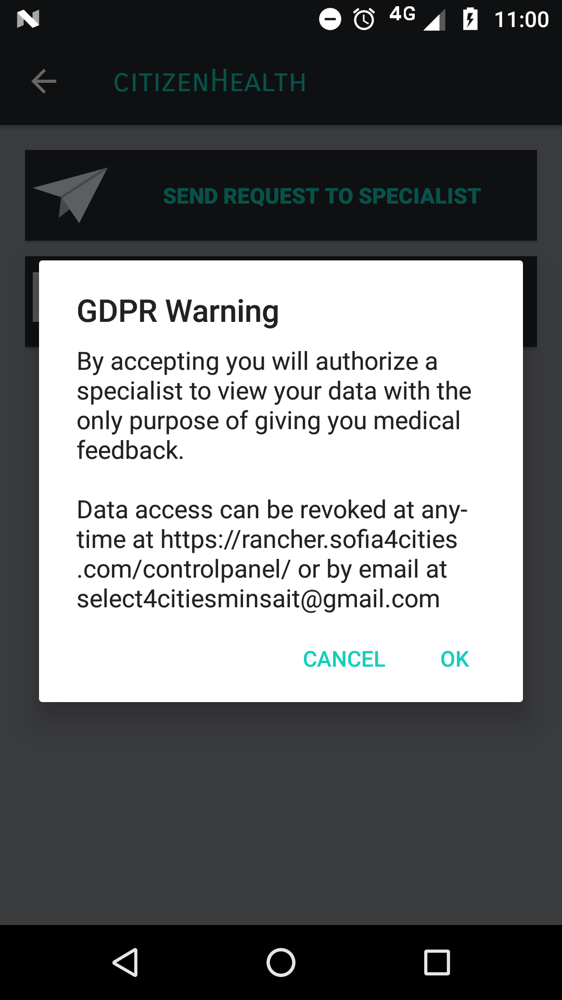

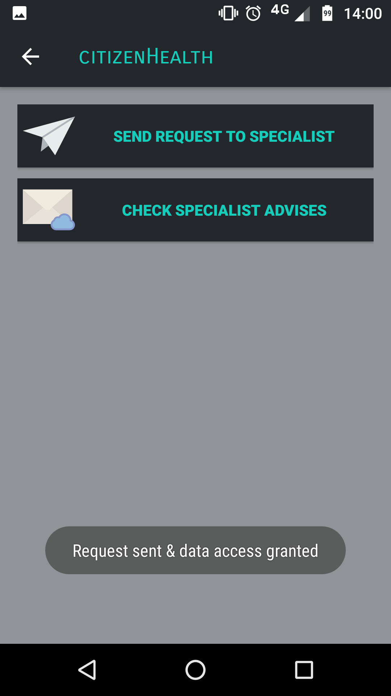

- Second button opens up the citizen inbox where the medical feedbacks appear. 

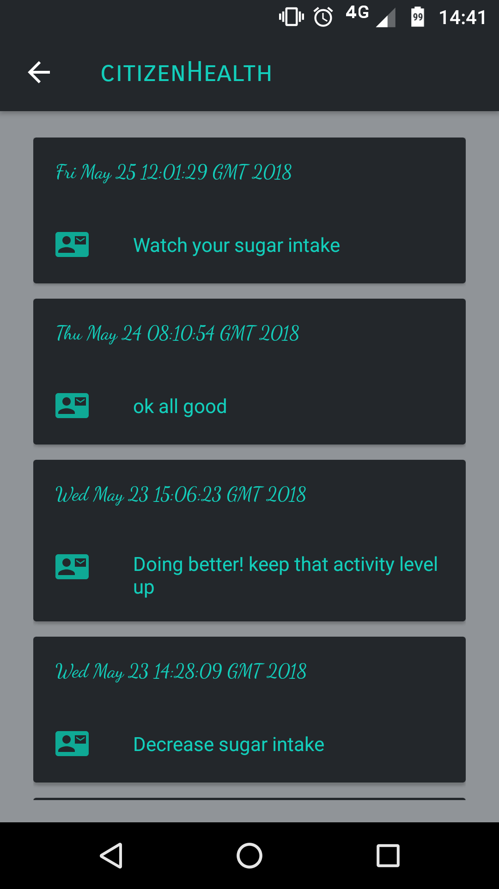

-By clicking on any medical record, the user can revoke data access to the specialist, since the info exchange has already been finished.

## User guide: specialistHealth

- After the welcome screen, the user will log in with the S4C credentials:

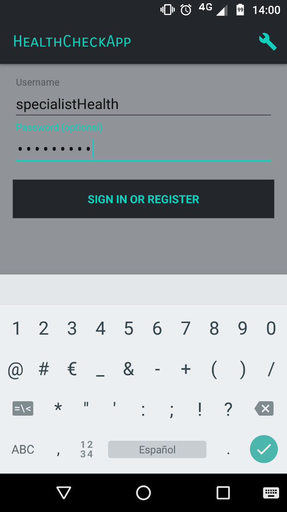

- Then the mailbox appears with anonymous patient identifiers:

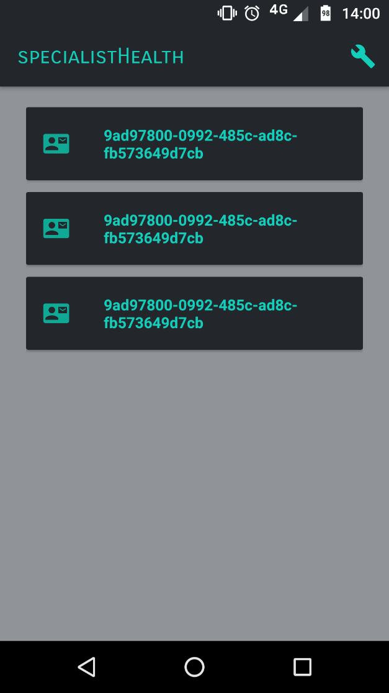

- Tapping on one of the request will access the patient data, and by pressing the feedback button the specialist can compose the feedback message

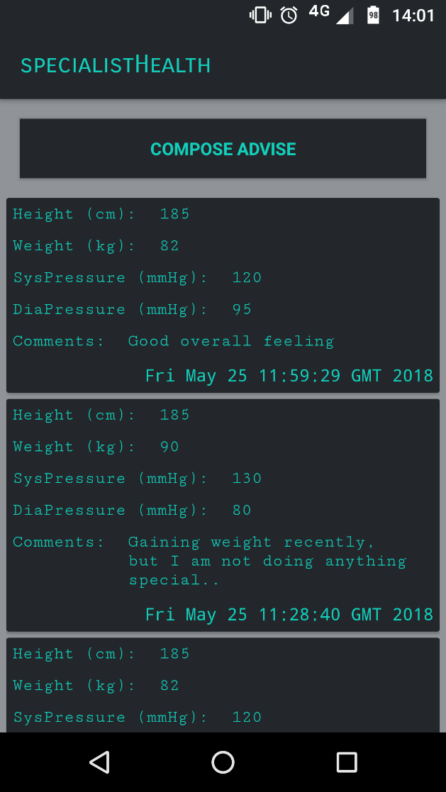

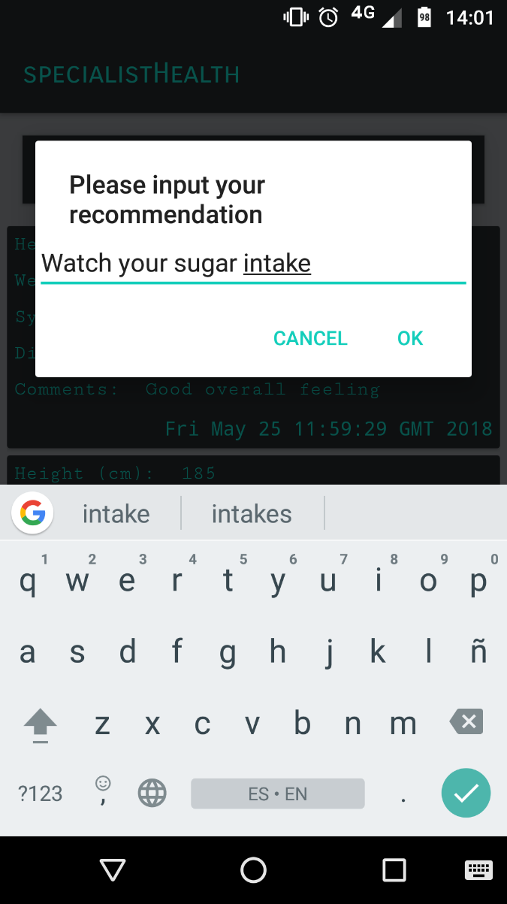

