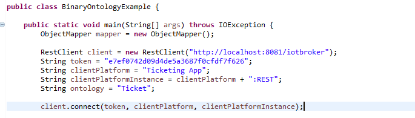
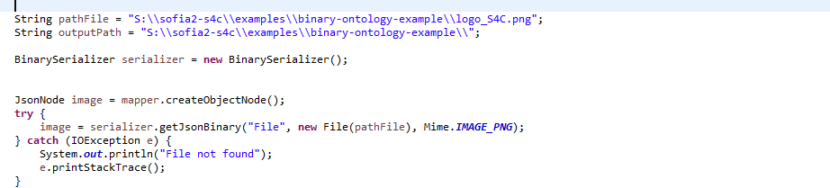
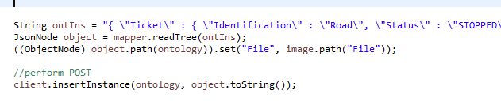
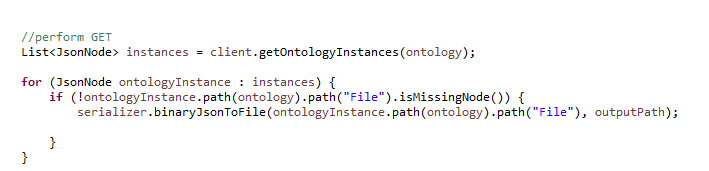

<p align="center">
  <a src='https://www.onesaitplatform.com/'>
    
  </a>
</p>

#Example: Ontology with binary data

The platform allows you to create ontologies with binary data in any of its properties. To achieve this, when you create the ontology, you must add a property to the ontology with the Data Type="binary".

This creates a structure with properties:
-	data
-	media

Data will be the binary data (base64 Encryption), and media has the following properties:
-	name: name of the file
-	storageArea: SERIALIZED, DATABASE, URL
-	binaryEncoding: Base64
-	mime: image/png, image/jpeg, application/pdf


## Java Support for generating an ontology's binary property

We have support for inserting ontology instances with binary data in them. You can find it in our SSAP library: com.indracompany.sofia2.ssap.util.BinarySerializer;


```
		<dependency>
			<groupId>com.minsait.onesait.platform</groupId>
			<artifactId>onesaitplatform-comms-protocol</artifactId>
			<version>${onesaitplatform.version}</version>
		</dependency>
```

This class has 3 methods:

1.	**getJsonBinary(String fieldName, File file, Mime mime)**: which returns a JsonNode object with the structure of a binary property, encrypting the file in base64.
2.	**public byte[] binaryJsonToFile(JsonNode binaryNode)**: which reads from a binary property Node, and decrypts File data into bytes.
3. 	**public void binaryJsonToFile(JsonNode binaryNode, String path)**: performs the same decryption process, but instead of returning the array of bytes, it creates the File in the output "path" specified.


## Java Example implementing ontology insertion with binary data

An example of Main class is provided, to illustrate how it works. This example uses RestClient form our Java Api.

-	First, we create the connection, with token, device, and device instance;


 


-	Then, we serialize the data of the image, by creating BinarySerializer object and calling getJsonbinary().


 


-	After, we add this "image" property to the ontology instance node, and perform the POST action via REST.





-	Lastly, we perform GET action to retrieve all ontology instances, and in case they have binary data, generate the image locally.




