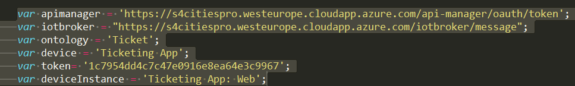
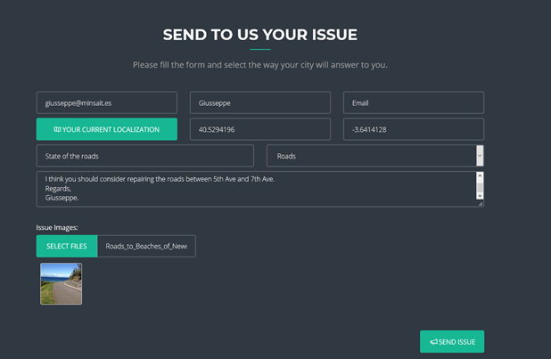
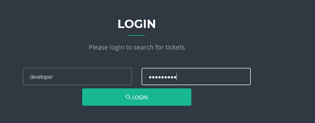

  

#Example: Issue Management

This is a demonstration of how we can use the platform for managing and creating issues.

This example, uses the JavaScript API to communicate with the platform. (Stomp WebSocket protocol).

How to use it:

-	First you should have created an ontology to represent the issues, and assigned it to a device with permissions.
	Parameters needed for this example to work are: ontology identification, device identificacion, device instance identification, token generated for the device, and lastly urls for the Iotbroker and Apimanager. All these parameters are set in /js/issueController.js

 

-	Open index.html
-	To create an issue, click on 'send', and fill the data, then click on 'send issue', you will get an ID assigned to your issue.

 

-	In case you have credentials to manage issues, yo can click on List, login with user and password (this is done via Api Manager).

 

-	Once authenticated, you can view all issues, and also update their status. In case you change the status, a flow is triggered in the flow engine, and a notification via email is sendt to the issue's creator.